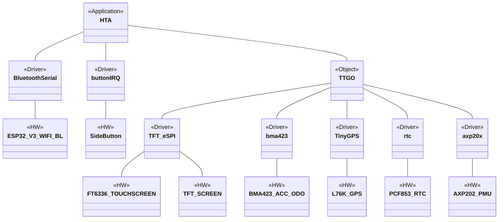

# Hiking Tour Assistant Smartwatch Application

## Description

HTA SWA is a firmware application for TTGO smartwatch.

## TTGO_FW Diagram

Note: This is not a class UML Diagram. More like a software layer diagram. Class Diagram is TBD.

