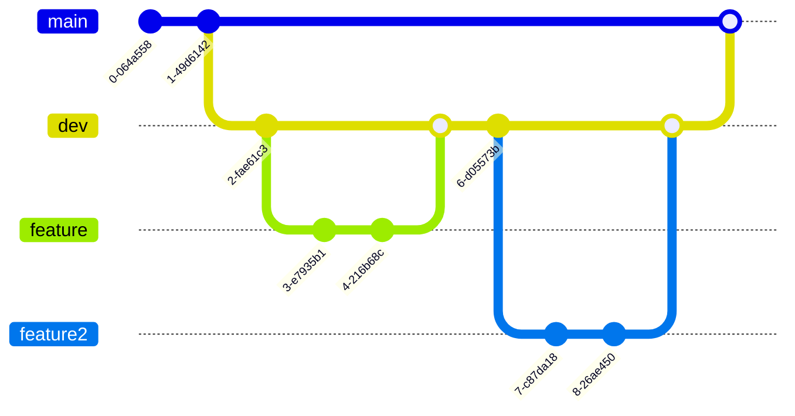

# Hiking Tour Assistant

## Description

Hiking Tour Assistant is a software product that allows users to record their hiking trips on TTGO smartwartch and observe sessions on Raspberry Pi. 

## Software Modules

HTA_RPIA: Raspberry Pi application for the Hiking Tour Assistant  
HTA_SWA: TTGO Smartwatch application for the Hiking Tour Assistant  

Module specific README.md files are located in the corresponding directories.

## Development
 
Branching strategy:
- main: stable version
- dev: integration branch
- feature branches: feature development

